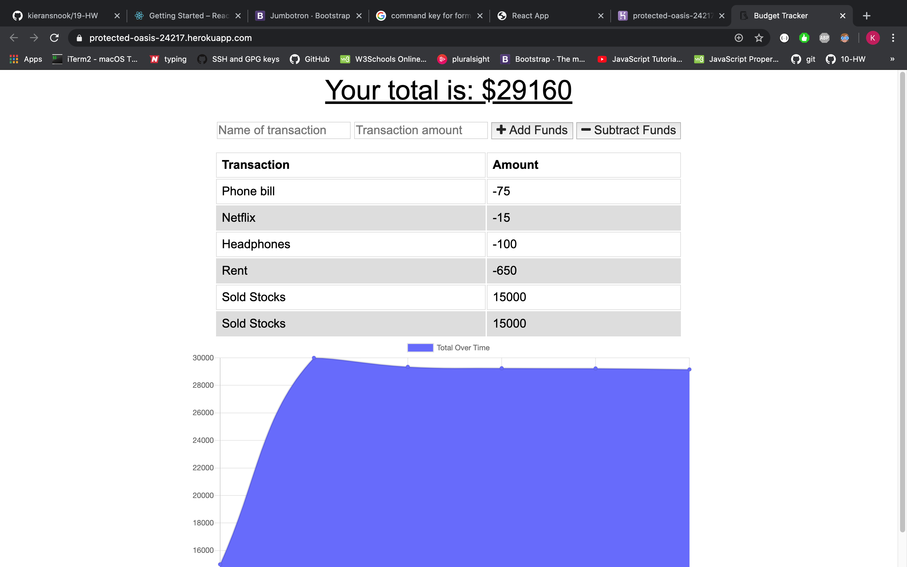

# Unit 18 PWA Homework: Budget App

A budget tracker made with HTML, CSS, Javascript, MongoDB, node.js, PWA.

For this homework assignemt i added offline functionality so that you can use the app without internet connection

## [CLICK HERE TO TRACK YOUR EXPENSES](https://protected-oasis-24217.herokuapp.com/)

## Screenshot

## User Story

AS A user
I WANT to be able to track my withdrawals and deposits with or without a data/internet connection
SO THAT my account balance is accurate when I am traveling

As a business traveler
I WANT a fast and easy way to track the money and access the information anytime and anywhere, 
SO THAT I can work offline and have the same functionality.

AS a user 
I WANT to work on the Budget App without an internet connection
AND WHEN I input any budget transaction (withdrawal, deposit, etc)
THEN I WANT the transacton to be shown on the page, 
AND AUTOMATICALLY ADDED to the database when the connection is back online.